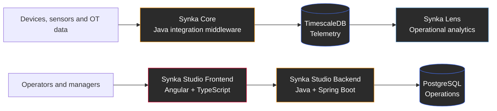

  

<h1 align="center">Vitor Hugo da Silva</h1>

  <strong>Java Backend Developer · Spring Boot · Angular · Linux</strong>

  Backend-first full-stack development — Java and Spring as the core, Angular as the frontend complement.

  <code>Java</code> •
  <code>Spring Boot</code> •
  <code>Angular</code> •
  <code>TypeScript</code> •
  <code>Linux</code> •
  <code>PostgreSQL</code> •
  <code>Docker</code> •
  <code>Industrial Systems &amp; IoT</code>

  
  
  
  

---

## About Me

I'm a **Software Developer from Brazil** focused primarily on **backend development with Java and Spring**.

My strongest area is designing and implementing backend systems: domain models, REST APIs, authentication, persistence, integrations, automated tests and containerized execution on Linux.

I use **Angular and TypeScript** as the frontend complement to my Java work, allowing me to build complete applications while maintaining backend engineering as my main specialization.

Industrial systems and IoT are application domains in my portfolio rather than hardware-centered career paths. Through the **Synka ecosystem**, I explore how Java backend systems can collect, protect, process and expose operational data reliably.

> I aim to build software that is understandable, testable, observable and resilient under real operating conditions.

---

## Career Focus

My professional direction is centered on:

* Java backend development
* Spring Boot and the Spring ecosystem
* Backend-first full-stack development with Angular
* REST APIs and system integrations
* Authentication and authorization
* Relational data modeling
* Automated and integration testing
* Linux-based development and deployment
* Containerized applications
* Industrial and IoT software integration

### Target Roles

* Java Backend Developer
* Spring Boot Developer
* Java Software Developer
* Java and Angular Developer
* Backend-first Full-Stack Developer
* Backend Developer for industrial or IoT systems

---

## The Synka Ecosystem

**Synka** is an open-source software ecosystem for backend development, industrial integration, operational management and analytics.

Each project has an independent responsibility while contributing to the same operational flow.

---

## Featured Projects

### Synka Studio — Full-Stack Industrial Platform

A full-stack platform for MES-style industrial applications, built with a **Java and Spring Boot backend** and an **Angular frontend**.

Synka Studio is my primary portfolio project for demonstrating professional backend development together with the ability to deliver complete web applications.

**Backend**

* Java and Spring Boot
* Clean Architecture
* Multi-module Maven project
* REST APIs
* Spring Security and JWT
* Multi-tenant data isolation
* Spring Data JPA and Hibernate
* PostgreSQL and Flyway
* JUnit and Testcontainers
* Docker and Docker Compose

**Frontend**

* Angular
* TypeScript
* Component-based user interface
* REST API integration
* Authentication and authorization flows
* Forms and data validation
* Operational and administrative screens
* Responsive web interface

**Main responsibility:** Java backend architecture and implementation.

**Frontend role:** Angular as the presentation and application interface for the Java backend.

➡️ **[github.com/ViktorWalde/SynkaStudio](https://github.com/ViktorWalde/SynkaStudio)**

---

### Synka Core — Resilient Java Integration Middleware

A Java middleware for collecting, normalizing, persisting and exposing industrial telemetry.

Synka Core applies backend engineering concepts to continuous integration workloads, including fault tolerance, local buffering, database recovery and operational observability.

**Highlights**

* Java and Spring Boot multi-module architecture
* Domain-oriented architecture
* Continuous data-collection worker
* REST API for telemetry access
* PostgreSQL and TimescaleDB
* SQLite store-and-forward buffer
* Circuit breaker, retry and timeout
* Resilience4j
* OPC UA integration with Eclipse Milo
* Health checks and structured logging
* JUnit, Mockito and Testcontainers
* Docker-based infrastructure

➡️ **[github.com/ViktorWalde/SynkaCore](https://github.com/ViktorWalde/SynkaCore)**

---

### Synka Lens — Supporting Analytics Project

A read-only analytics application that transforms industrial time-series data into operational metrics.

Synka Lens complements my Java portfolio by demonstrating how data generated by backend and integration systems can be validated, transformed and presented.

**Highlights**

* Python data pipeline
* TimescaleDB as the source
* Bronze, silver and gold transformation layers
* DuckDB and Parquet
* Data-quality validation
* Gap detection
* Operational metrics
* Streamlit dashboard
* Automated tests

➡️ **[github.com/ViktorWalde/SynkaLens](https://github.com/ViktorWalde/SynkaLens)**

---

## Technical Stack

### Primary — Java Backend

* Java
* Spring Boot
* Spring Security
* Spring Data JPA
* Hibernate
* Maven
* REST APIs
* JWT authentication
* Clean Architecture
* Modular monoliths
* Background workers
* System integrations

### Full-Stack Complement — Angular

* Angular
* TypeScript
* HTML
* CSS
* Components and services
* Reactive forms
* REST API consumption
* Route protection
* Authentication flows
* Administrative interfaces

### Databases and Persistence

* PostgreSQL
* TimescaleDB
* SQLite
* SQL
* JPA and Hibernate
* Flyway migrations
* Relational data modeling
* Time-series data

### Testing and Software Quality

* JUnit 5
* Mockito
* Testcontainers
* Unit tests
* Integration tests
* End-to-end backend tests
* Static analysis
* Reproducible builds
* Architecture boundaries

### Platform and Delivery

* Linux-first development
* Docker
* Docker Compose
* Git and GitHub
* GitHub Actions
* Containerized databases
* CI-oriented workflows
* Application configuration

### Industrial Systems and IoT

* OPC UA
* MQTT
* Industrial telemetry
* OT/IT integration
* Store-and-forward
* Fault-tolerant ingestion
* Edge-to-backend communication
* Operational observability

### Supporting Data Tools

Python is a supporting technology in my portfolio, used primarily for analytics, data validation and transformation pipelines around Java-based systems.

---

## Currently Developing

* Advanced Java and Spring architecture
* Secure REST APIs
* Angular applications integrated with Spring Boot
* Authentication and authorization flows
* PostgreSQL modeling and migrations
* JUnit and Testcontainers
* Docker-based deployment
* System observability
* Resilient integration services
* Industrial and IoT backend applications

---

## Professional Interests

`Java Backend` ·
`Spring Boot` ·
`Angular` ·
`TypeScript` ·
`Software Architecture` ·
`API Design` ·
`PostgreSQL` ·
`Linux` ·
`Docker` ·
`Distributed Systems` ·
`Industrial Systems` ·
`IoT Integration`

---

## GitHub Activity

  

---

## Get in Touch

  
  
  

  <strong>Paraná — Brazil</strong>

